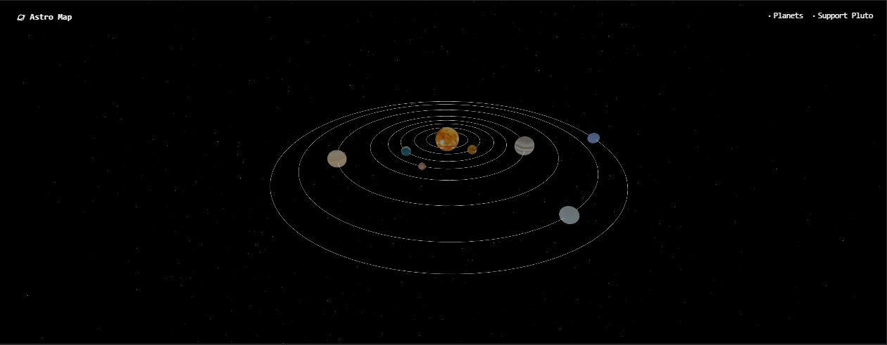
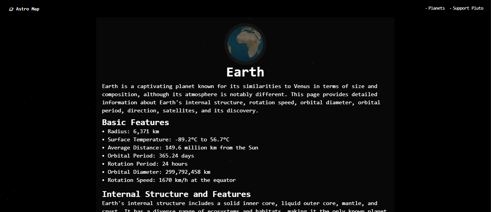

# Astro Map

Welcome to Astro Map, your guide to the universe! 🚀 Explore 3D planetary maps and learn fascinating facts about celestial bodies.

## About

Astro Map is a website where you can see the planets in 3D and learn about various celestial bodies in our solar system. Each planet comes to life with intricate details and interesting facts.

## Features

- **Interactive 3D Maps:** Explore the planets in high resolution.
- **In-Depth Information:** Dive deep into the mysteries of each planet, including composition, atmosphere, and more.
- **Educational Content:** Learn about space, astronomy, and our solar system in an engaging way.
- **User-Friendly Interface:** Intuitive design for seamless navigation and an enjoyable user experience.


## Technologies Used
 - **HTML:** Frontend development for the user interface.
 - **CSS/TailwindCSS:** Styling and layout of the website.
- **Three.js:** JavaScript library for creating 3D graphics in the browser.
- **Next.js:** React framework for building server-side rendered websites and api services.
- **Vercel:** Hosting and deployment of the website.

## Getting Started

To get started with Astro Map, simply visit our website at [astromap-project.vercel.app](https://astromap-project.vercel.app/) and start exploring the wonders of the universe!

## Contributing

We welcome contributions from the community. If you'd like to contribute to Astro Map, please follow these steps:

1. Fork the repository.
2. Create a new branch for your feature or bug fix.
3. Make your changes and submit a pull request.

## How to run

To run this project locally, follow these steps:

1. **Clone the Repository:**
   ```bash
   git clone https://github.com/ErsaGunTosun/astro-map.git
   cd astro-map
   npm install
   ```
2. **Start the Development Server:**
   ```bash
   npm install
   npm run dev
    ```
3. **Create a .env File:**
    - Duplicate the .env.example file and rename the copy to .env.
    - Open the .env file and add your API Url, credentials, or any sensitive information needed for the project. Ensure this file is never shared or exposed publicly.
4. **Start and Open the Project:**
    ```bash
    npm run dev
    ```
    The project will be available at http://localhost:3000.

## Contact

If you have any questions or suggestions, feel free to reach out to us at [ersagun@ersaguntosun.com ](mailto:ersagun@ersaguntosun.com).

Happy exploring! 🌌